# Material de Suporte — O que é um Microserviço

**Objetivo:** Entender o que é uma arquitetura de microserviços, por que ela existe, quais problemas ela resolve (e quais ela cria), e os principais conceitos que você precisa conhecer para trabalhar com ela.

> **Contexto no projeto:** O `vendas-ms` que você está construindo **é** um microserviço. O sufixo `-ms` não é coincidência — é a abreviação de *microservice*. Ao final deste material você vai entender o que isso significa e quais são as implicações.

---

## Parte 1 — O ponto de partida: o Monólito

Antes de entender microserviços, é preciso entender o que existia antes: a arquitetura **monolítica**.

### O que é um monólito?

Um **monólito** é uma aplicação em que todas as funcionalidades — clientes, pedidos, pagamentos, estoque, notificações — são desenvolvidas, implantadas e executadas como **uma única unidade**.

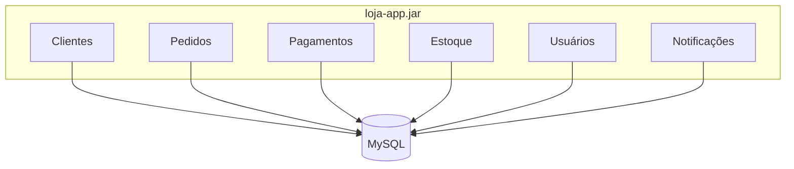

Você sobe **um** processo. Tudo compartilha a mesma memória, o mesmo banco de dados, o mesmo processo de build e deploy.

### Problemas do monólito em escala

| Problema | O que acontece na prática |
|---|---|
| **Deploy acoplado** | Para corrigir um bug no módulo de clientes, é preciso fazer deploy da aplicação inteira |
| **Escalabilidade engessada** | Se o módulo de pedidos precisa de mais CPU, você escala a aplicação inteira, incluindo módulos que não precisam |
| **Time bomb tecnológica** | Toda a aplicação usa a mesma versão de Java, Spring, Hibernate — atualizar uma dependência afeta tudo |
| **Times que se bloqueiam** | Dois times trabalhando em módulos diferentes na mesma base de código criam conflitos de merge e coordenação constante |
| **Falha catastrófica** | Um vazamento de memória no módulo de relatórios pode derrubar os pedidos e os pagamentos |

> **Atenção:** monólito **não é errado**. Para equipes pequenas e aplicações jovens, ele é frequentemente a escolha certa. Os problemas acima surgem com o crescimento. Esta é a regra geral: comece simples, decomponha quando a dor justificar o custo.

---

## Parte 2 — Microserviços: a solução (e seus trade-offs)

### O que é um microserviço?

Um **microserviço** é uma aplicação pequena e autônoma que:
1. É responsável por **um domínio específico** do negócio (clientes, pedidos, pagamentos…)
2. É **implantada independentemente** dos outros serviços
3. **Se comunica pela rede** com os outros serviços (HTTP/REST, mensagens assíncronas)
4. Possui seu **próprio banco de dados** — não compartilha dados diretamente com outros serviços

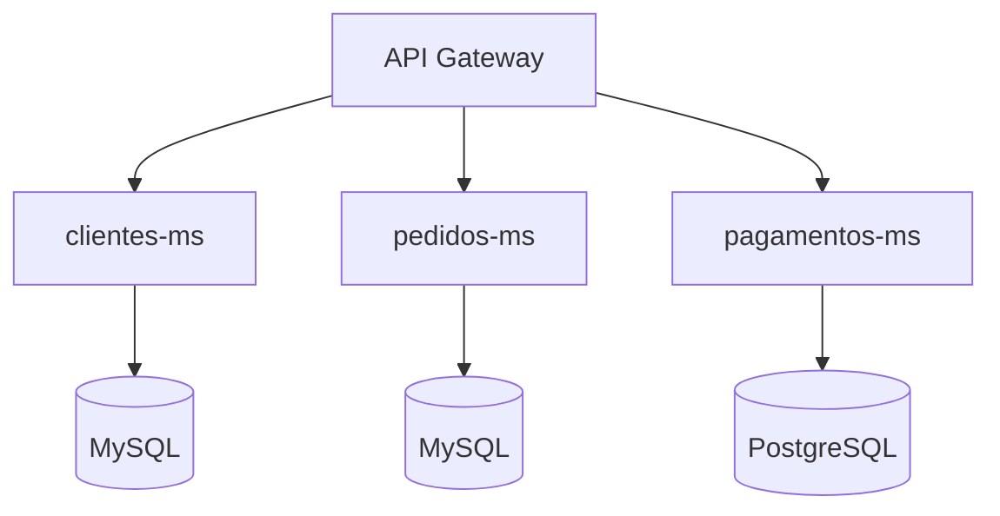

O `vendas-ms` que você está construindo é o serviço `pedidos-ms` desse diagrama: responsável por clientes e pedidos de vendas, implantado de forma independente, com seu próprio banco de dados MySQL.

### Comparação: monólito vs microserviços

| Aspecto | Monólito | Microserviços |
|---|---|---|
| **Deploy** | Uma unidade, tudo junto | Cada serviço implantado independentemente |
| **Escalabilidade** | Toda a aplicação | Apenas os serviços que precisam |
| **Banco de dados** | Compartilhado | Um por serviço |
| **Comunicação interna** | Chamada de método (na memória) | HTTP ou mensageria (pela rede) |
| **Falha isolada** | Um módulo pode derrubar tudo | Falha de um serviço não necessariamente afeta os outros |
| **Complexidade** | Baixa operacionalmente | Alta — requer orquestração, service discovery, observabilidade |
| **Recomendado para** | Times pequenos, produto em validação | Produtos maduros, times grandes, escala |

---

## Parte 3 — Conceitos fundamentais

### 3.1 Domínio e Bounded Context

O conceito de **domínio** vem do **Domain-Driven Design (DDD)**: é a área do negócio que o software modela. Um microserviço deve ser responsável por um **Bounded Context** — uma fronteira clara dentro do domínio onde um conjunto de conceitos tem um significado único e consistente.

**Exemplo prático:**

A palavra "cliente" pode significar coisas diferentes em contextos diferentes:
- Para o serviço de **vendas**: cliente é quem fez um pedido (CPF, nome, endereço de entrega)
- Para o serviço de **marketing**: cliente é um lead com histórico de campanhas e score de engajamento
- Para o serviço de **financeiro**: cliente é um devedor com limite de crédito e histórico de pagamentos

Cada serviço tem sua **própria definição** de cliente, adequada ao seu contexto. Eles não compartilham a mesma tabela `clientes` — cada um tem a sua.

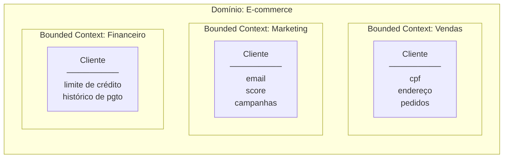

> **Regra prática:** se dois serviços precisam dos mesmos dados, eles podem se comunicar via API — mas cada um armazena os dados que lhe interessam em seu próprio banco.

---

### 3.2 API Gateway

Com múltiplos serviços rodando em endereços diferentes, o cliente (browser, app mobile) não pode conhecer o endereço de cada um. O **API Gateway** é o ponto de entrada único que:

- Recebe todas as requisições do cliente
- Roteia cada requisição para o serviço correto
- Pode aplicar autenticação, rate limiting e logging de forma centralizada

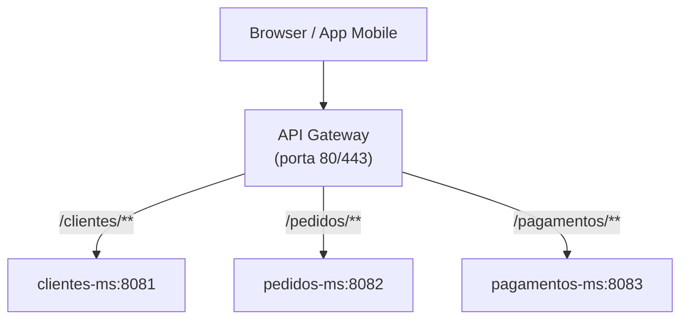

**Exemplos de API Gateways:**
- **Spring Cloud Gateway** — para ecossistemas Spring Boot
- **Kong** — independente de linguagem, altamente configurável
- **AWS API Gateway** — gerenciado na nuvem AWS
- **NGINX** — proxy reverso que pode funcionar como gateway simples

---

### 3.3 Comunicação entre serviços

Quando serviços precisam se falar, existem dois modelos:

#### Comunicação síncrona (HTTP/REST)

Um serviço chama o outro diretamente e **espera a resposta** antes de continuar.

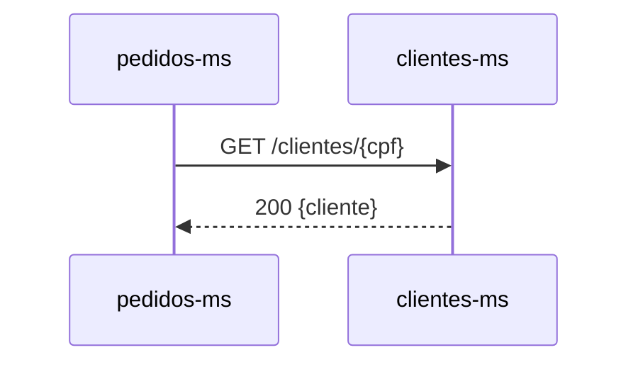

**Ferramentas:** REST com `RestTemplate`, `WebClient`, ou **OpenFeign** (que você já usou para chamar o ViaCEP).

**Vantagem:** simples de implementar e debugar.
**Desvantagem:** se `clientes-ms` está fora do ar, `pedidos-ms` também falha. Os serviços ficam **temporariamente acoplados**.

#### Comunicação assíncrona (mensageria)

Um serviço publica uma mensagem em um **broker** (fila/tópico) e continua. O outro serviço consome a mensagem quando estiver disponível.

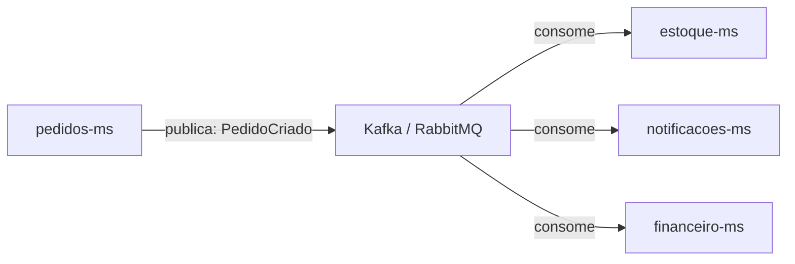

**Ferramentas:** **Apache Kafka**, **RabbitMQ**, **AWS SQS/SNS**

**Vantagem:** desacoplamento total — se `estoque-ms` cair, o pedido ainda é criado; quando ele voltar, o evento ainda estará na fila.
**Desvantagem:** mais complexo de implementar, testar e monitorar. A consistência dos dados é **eventual**, não imediata.

| | Síncrona (REST) | Assíncrona (Mensageria) |
|---|---|---|
| **Modelo** | Request/Response | Publish/Subscribe |
| **Acoplamento temporal** | Alto — emissor espera o receptor | Baixo — emissor não precisa do receptor ativo |
| **Consistência** | Imediata | Eventual |
| **Quando usar** | Quando precisa da resposta para continuar | Quando a operação pode ser processada depois |
| **Exemplo** | Buscar dados de um cliente | Notificar estoque após criar pedido |

---

### 3.4 Service Discovery

Em um ambiente com muitos serviços e instâncias que sobem e caem dinamicamente (especialmente em containers), os endereços IP não são fixos. O **Service Discovery** resolve isso:

- Cada serviço ao iniciar se **registra** em um servidor central com seu nome e endereço
- Quando um serviço quer chamar outro, ele **consulta** o servidor para descobrir o endereço atual

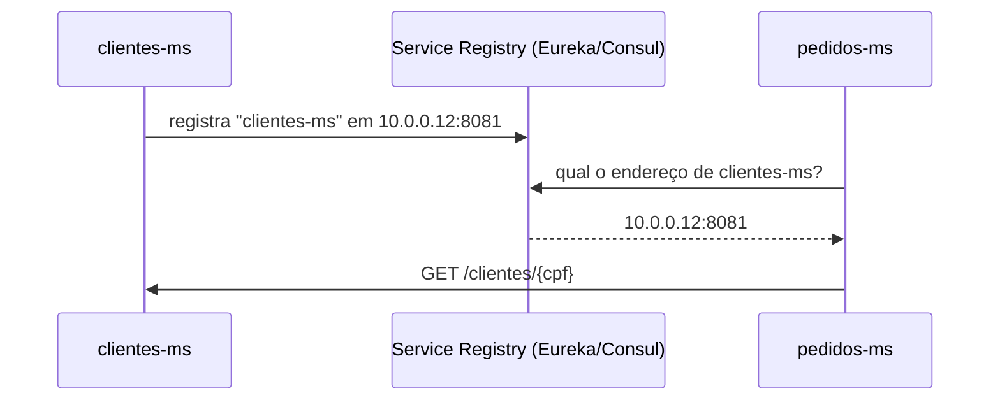

**Ferramentas:** **Netflix Eureka** (Spring Cloud), **Consul**, **Kubernetes Service** (o Kubernetes tem service discovery nativo).

---

### 3.5 Circuit Breaker (Disjuntor)

Imagine que `pagamentos-ms` está lento: cada chamada demora 10 segundos antes de expirar. `pedidos-ms` faz 100 chamadas simultâneas e trava todas as suas threads esperando respostas que nunca chegam. O resultado: `pedidos-ms` também fica indisponível — o problema se **propaga** em cascata.

O **Circuit Breaker** funciona como um disjuntor elétrico:

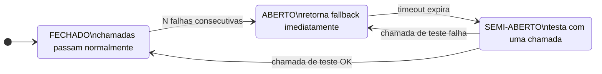

**Ferramentas:** **Resilience4j** (padrão atual no Spring), **Hystrix** (legado da Netflix, em manutenção).

```java
// Exemplo com Resilience4j no Spring Boot
@CircuitBreaker(name = "pagamentos", fallbackMethod = "pagamentoFallback")
public PagamentoDto processarPagamento(PedidoDto pedido) {
    return pagamentosClient.processar(pedido);
}

public PagamentoDto pagamentoFallback(PedidoDto pedido, Exception e) {
    // Resposta alternativa: coloca na fila para processar depois
    return PagamentoDto.pendente(pedido.getId());
}
```

---

### 3.6 Database per Service

Um dos princípios mais importantes — e mais difíceis de seguir — é que cada microserviço deve ter seu **próprio banco de dados**, acessível apenas por ele.

**ERRADO — banco compartilhado:**

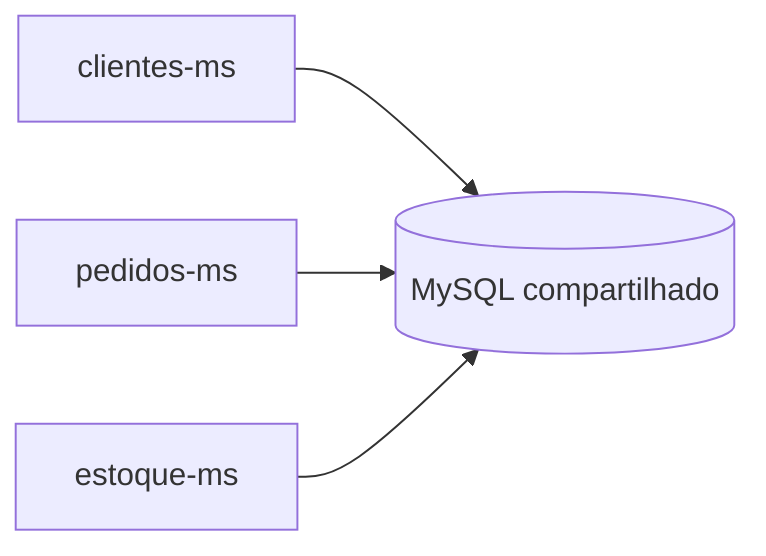

Uma migration no `clientes-ms` pode quebrar o `estoque-ms`. O `pedidos-ms` pode ler dados "internos" do `clientes-ms` diretamente. Não é possível escalar os bancos independentemente.

**CORRETO — banco por serviço:**

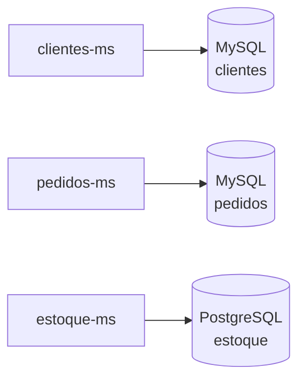

Cada serviço pode inclusive usar um banco de dados diferente, adequado às suas necessidades.

**Consequência:** para obter dados de outro serviço, você precisa chamá-lo pela API — nunca acessar seu banco diretamente. Isso garante o encapsulamento e a independência real entre os serviços.

---

### 3.7 Containerização com Docker

Antes dos containers, implantar um serviço significava configurar o servidor: instalar o Java na versão certa, configurar variáveis de ambiente, lidar com conflitos entre aplicações. Em um ambiente com dezenas de microserviços, isso é inviável.

O **Docker** resolve isso empacotando a aplicação e todas as suas dependências em uma **imagem** portátil:

```dockerfile
# Dockerfile para o vendas-ms
FROM eclipse-temurin:21-jre
WORKDIR /app
COPY target/vendas-ms.jar app.jar
EXPOSE 8080
ENTRYPOINT ["java", "-jar", "app.jar"]
```

```bash
# Construir a imagem
docker build -t vendas-ms:1.0 .

# Rodar o container
docker run -p 8080:8080 -e SPRING_DATASOURCE_URL=jdbc:mysql://... vendas-ms:1.0
```

**Conceitos-chave do Docker:**

| Conceito | Analogia | O que é |
|---|---|---|
| **Dockerfile** | Receita | Instruções para construir a imagem |
| **Image** | Classe | Template imutável com o código + dependências |
| **Container** | Instância | Processo em execução criado a partir de uma imagem |
| **Registry** | NPM/Maven Central | Repositório de imagens (Docker Hub, ECR, GCR) |
| **compose.yaml** | `docker-compose` | Orquestra múltiplos containers localmente |

> Você já usa o Docker no projeto: o `compose.yaml` que sobe o MySQL é o Docker Compose. O banco de dados do `vendas-ms` roda em um container Docker.

---

### 3.8 Orquestração com Kubernetes

O Docker Compose é ótimo para desenvolvimento local, mas em produção você precisa de mais: escalar automaticamente, reiniciar serviços que caem, distribuir carga entre instâncias, fazer deploys sem downtime.

O **Kubernetes (K8s)** é o orquestrador de containers mais usado em produção:

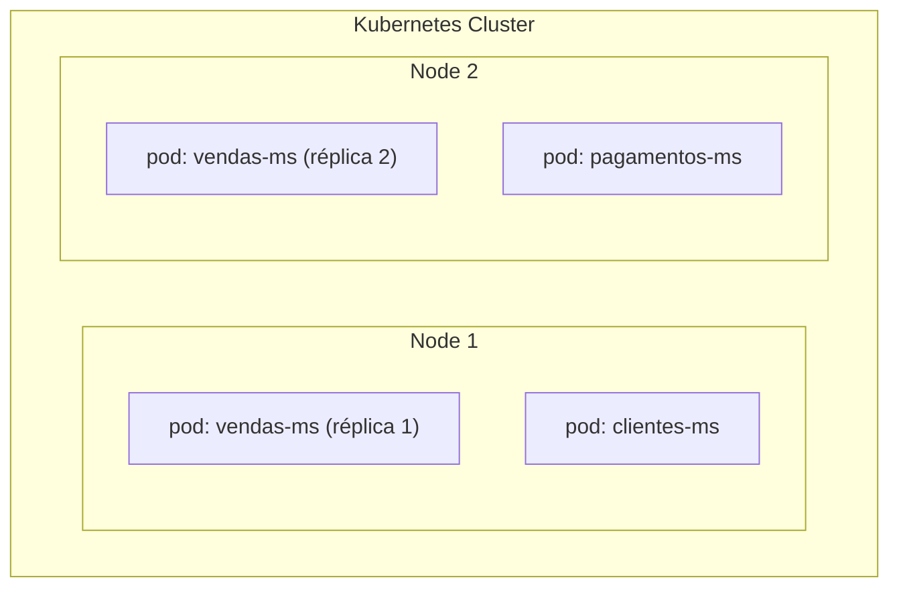

**Conceitos básicos do Kubernetes:**

| Conceito | O que é |
|---|---|
| **Pod** | A menor unidade — um ou mais containers rodando juntos |
| **Deployment** | Define quantas réplicas de um pod devem existir e como atualizá-las |
| **Service** | Endereço estável para acessar um conjunto de pods (service discovery nativo) |
| **Ingress** | Ponto de entrada externo — funciona como o API Gateway para o cluster |
| **ConfigMap / Secret** | Variáveis de configuração e credenciais separadas do código |
| **Namespace** | Agrupamento lógico de recursos dentro do cluster |

> Para o contexto da FIAP, o importante é entender que o Kubernetes é a plataforma onde microserviços rodam em produção. O `compose.yaml` local é o equivalente simplificado para desenvolvimento.

---

### 3.9 Observabilidade

Com dezenas de serviços, quando algo dá errado, como você descobre **onde** está o problema? A **observabilidade** é composta por três pilares:

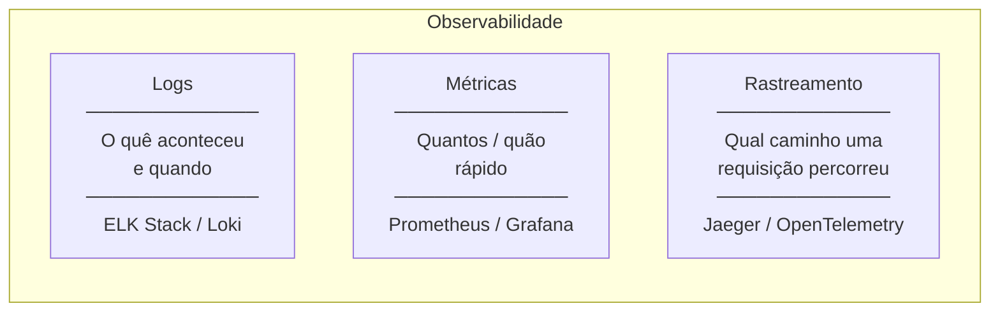

#### Distributed Tracing

É o conceito mais crítico para microserviços: uma requisição do usuário pode passar por 5 serviços diferentes. Como rastrear o fluxo completo?

A solução é um **Trace ID** — um identificador único gerado na entrada que é propagado em todos os headers HTTP ao longo da cadeia:

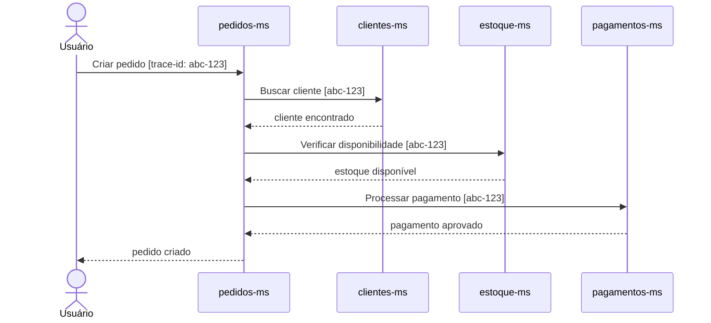

Com o `trace-id`, você busca em um sistema centralizado de logs e vê **toda** a jornada de uma requisição, mesmo que ela tenha passado por múltiplos serviços.

**Ferramentas:** **OpenTelemetry** (padrão aberto), **Jaeger**, **Zipkin**, **AWS X-Ray**.

---

### 3.10 Consistência eventual e o Teorema CAP

Em um sistema distribuído, quando você grava dados em um serviço, eles **não aparecem imediatamente** em todos os outros serviços — especialmente com comunicação assíncrona.

**Consistência eventual** significa: o sistema **vai** atingir um estado consistente, mas pode não ser imediato.

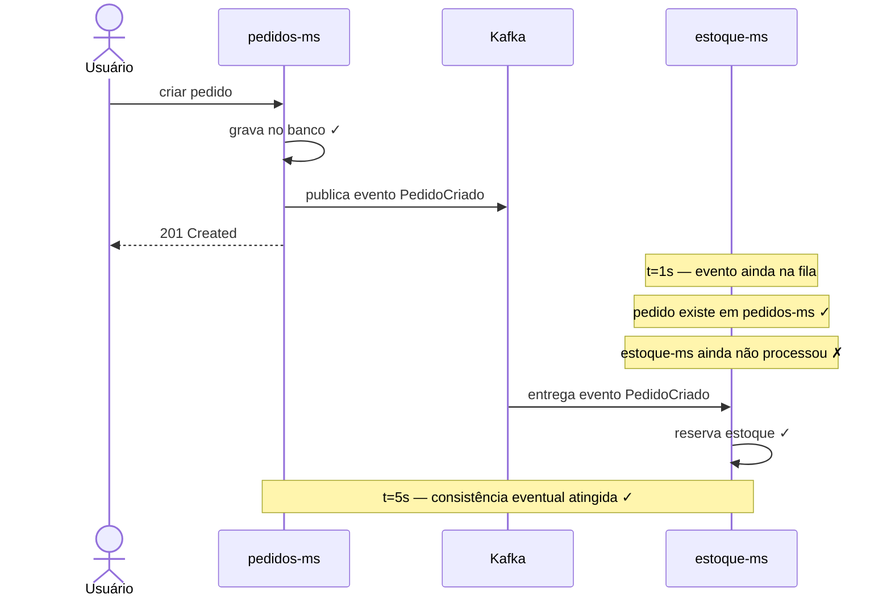

**O Teorema CAP** afirma que um sistema distribuído pode garantir no máximo **dois** dos três:

| Propriedade | O que significa |
|---|---|
| **Consistency (C)** | Toda leitura vê a escrita mais recente |
| **Availability (A)** | Toda requisição recebe uma resposta (mesmo que não seja a mais recente) |
| **Partition tolerance (P)** | O sistema continua funcionando mesmo com falhas de rede entre os nós |

> Na prática, em sistemas distribuídos a falha de rede (P) é inevitável — você precisa tolerá-la. Então a escolha real é entre **CP** (consistência + tolerância, sacrifica disponibilidade) ou **AP** (disponibilidade + tolerância, sacrifica consistência imediata). A maioria dos microserviços escolhe **AP** e aceita consistência eventual.

---

## Parte 4 — O `vendas-ms` no contexto de microserviços

Agora que você conhece os conceitos, veja como o projeto se encaixa:

| Conceito | Como aparece no `vendas-ms` |
|---|---|
| **Microserviço** | A aplicação inteira é um serviço com escopo definido: gestão de vendas |
| **Bounded Context** | Clientes e pedidos no contexto de vendas — com seus próprios campos e regras |
| **Banco por serviço** | MySQL próprio, configurado no `compose.yaml` e `application.properties` |
| **Comunicação síncrona** | OpenFeign chamando a API ViaCEP — um serviço externo |
| **Containerização** | O MySQL roda em Docker; a aplicação pode ser containerizada com um Dockerfile |
| **Autenticação delegada** | OAuth2 com GitHub — autenticação como serviço externo (sem gerenciar senhas) |
| **Controle de acesso** | Spring Security + `ROLE_PEDIDO` — autorização dentro do serviço |

### O que falta para ser um microserviço de produção?

O `vendas-ms` atual é um microserviço em desenvolvimento. Para estar pronto para produção em um ecossistema distribuído, precisaria de:

- **API Gateway** — para ser exposto externamente junto com outros serviços
- **Service Discovery** — para que outros serviços possam encontrá-lo dinamicamente
- **Circuit Breaker** — para lidar com falhas de serviços externos (ViaCEP, futuros serviços internos)
- **Distributed Tracing** — para rastrear requisições em um sistema com múltiplos serviços
- **Dockerfile** — para ser implantado em qualquer ambiente de forma consistente
- **Health check endpoint** — `/actuator/health` para que o orquestrador saiba se está vivo

---

## Parte 5 — Quando NÃO usar microserviços

Microserviços não são bala de prata. Eles resolvem problemas que surgem com **escala** — de produto, de times, de tráfego. Antes dessa escala, eles introduzem complexidade sem benefício proporcional.

**Sinais de que o monólito ainda é a escolha certa:**

- O produto ainda está sendo validado no mercado (não faz sentido otimizar o que pode mudar completamente)
- O time tem menos de ~8 pessoas (o overhead operacional de microserviços consome tempo de desenvolvimento)
- As fronteiras de domínio ainda não estão claras (um microserviço mal dividido é pior que um monólito)

**Sinais de que pode ser hora de decompor:**

- Times diferentes estão bloqueados uns pelos outros para fazer deploys
- Uma parte da aplicação precisa de escalabilidade muito diferente das outras
- Partes do sistema precisam de tecnologias radicalmente diferentes (ex: ML em Python, API em Java)
- O processo de build e teste já demora mais de 20-30 minutos

> **Estratégia comum:** começar com um monólito bem estruturado (com módulos bem separados internamente) e extrair microserviços conforme a necessidade aparece. Isso é chamado de **"Strangler Fig Pattern"** — o monólito vai sendo gradualmente substituído pelos serviços.

---

## Glossário rápido

| Termo | Significado |
|---|---|
| **ms** | Abreviação de *microservice* |
| **API Gateway** | Ponto de entrada único que roteia requisições para os serviços corretos |
| **Service Discovery** | Mecanismo para serviços se encontrarem dinamicamente em vez de usar IPs fixos |
| **Circuit Breaker** | Padrão que interrompe chamadas a serviços com falha para evitar cascata |
| **Eventual Consistency** | O sistema atingirá consistência, mas não necessariamente de forma imediata |
| **Bounded Context** | Fronteira de domínio dentro da qual um conjunto de conceitos tem significado único |
| **Broker** | Intermediário de mensagens (Kafka, RabbitMQ) usado na comunicação assíncrona |
| **Pod** | Menor unidade implantável no Kubernetes — um ou mais containers |
| **Trace ID** | Identificador propagado entre serviços para rastrear uma requisição de ponta a ponta |
| **Sidecar** | Container auxiliar implantado junto com o serviço principal (ex: proxy de observabilidade) |
| **DDD** | Domain-Driven Design — abordagem de design que organiza o código em torno do domínio |
| **CAP** | Teorema: um sistema distribuído não pode garantir Consistência, Disponibilidade e Tolerância a partições simultaneamente |

---

## Checklist de aprendizado

- [ ] Sei explicar a diferença entre arquitetura monolítica e microserviços
- [ ] Entendo por que o monólito não é necessariamente errado — e quando ele é a escolha certa
- [ ] Sei o que é um Bounded Context e por que ele define as fronteiras de um microserviço
- [ ] Entendo o princípio "database per service" e suas consequências
- [ ] Sei a diferença entre comunicação síncrona (REST) e assíncrona (mensageria) e quando usar cada uma
- [ ] Entendo o que é um API Gateway e por que ele existe
- [ ] Sei o que é Service Discovery e por que IPs fixos não funcionam em ambientes dinâmicos
- [ ] Entendo o padrão Circuit Breaker e o problema de cascata que ele resolve
- [ ] Sei o que é Docker e a diferença entre imagem e container
- [ ] Sei o que é Kubernetes e qual o papel de um Pod, Deployment e Service
- [ ] Entendo os três pilares da observabilidade: logs, métricas e rastreamento distribuído
- [ ] Sei o que é consistência eventual e o Teorema CAP
- [ ] Consigo identificar o `vendas-ms` como um microserviço e localizar os conceitos aprendidos no projeto
- [ ] Sei quando microserviços fazem sentido e quando o monólito ainda é a escolha certa
