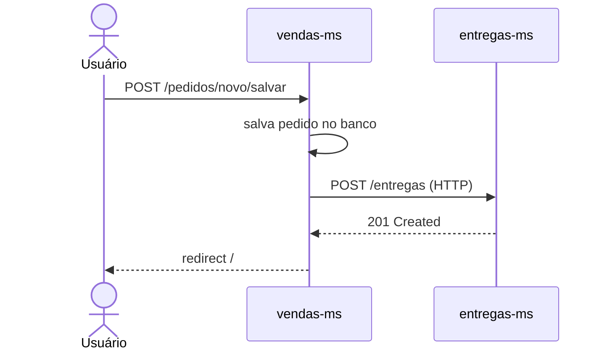
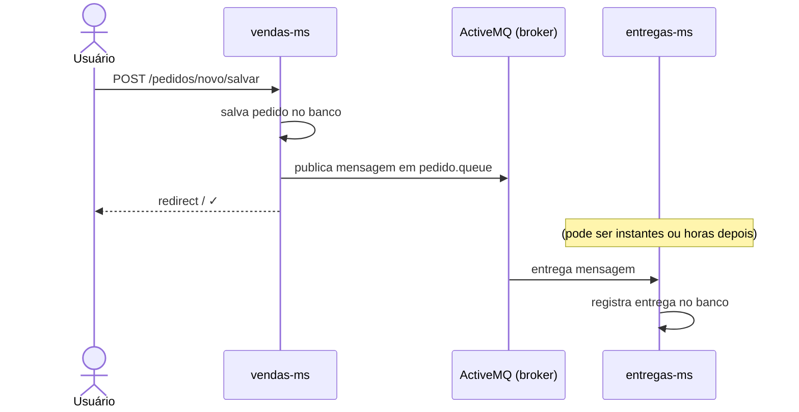
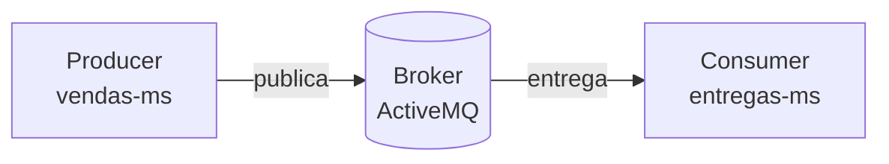
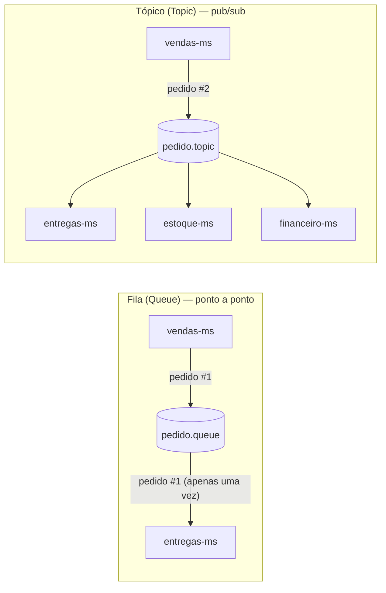
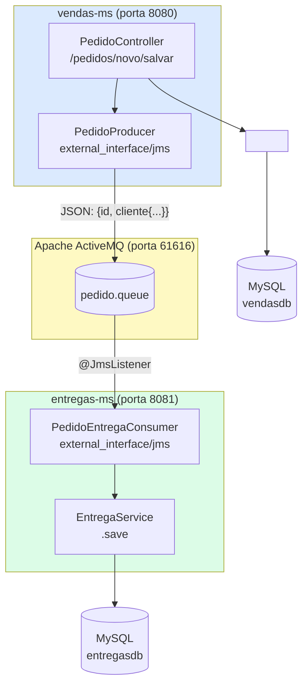

# Material de Suporte — Mensageria com JMS e Apache ActiveMQ

**Objetivo:** Entender o que é mensageria assíncrona, por que ela existe em arquiteturas de microserviços, e como implementar um fluxo completo de **producer** e **consumer** usando JMS com Apache ActiveMQ no Spring Boot.

> **Contexto no projeto:** O `vendas-ms` cria pedidos. O `entregas-ms` precisa criar uma entrega assim que um pedido é registrado. Hoje os dois sistemas não conversam. Ao final desta aula, `vendas-ms` vai **publicar** uma mensagem e `entregas-ms` vai **consumir** essa mensagem e registrar a entrega — tudo de forma assíncrona.

---

## Parte 1 — O problema que mensageria resolve

Olhe para o `entregas-ms` como ele está agora. É um sistema completo de gestão de entregas: você pode ver pendentes, em curso, finalizadas, e avançar o status manualmente. Mas tem um problema fundamental:

**Como uma entrega entra no sistema?**

Atualmente, ela não entra sozinha. Alguém teria que cadastrá-la manualmente, o que não faz sentido em um sistema real. O fluxo correto é:

```
[usuário cria um pedido no vendas-ms] → [entregas-ms precisa saber] → [entrega é registrada automaticamente]
```

A pergunta é: como o `vendas-ms` avisa o `entregas-ms` que um novo pedido foi criado?

### Opção 1 — Chamada HTTP direta (síncrona)



Funciona, mas tem um problema sério: se `entregas-ms` estiver fora do ar quando o usuário criar o pedido, a criação do pedido **falha**. Dois sistemas independentes ficam acoplados — a disponibilidade de um depende do outro.

### Opção 2 — Mensagem assíncrona (broker)



`vendas-ms` não espera o `entregas-ms`. Se `entregas-ms` estiver fora do ar, a mensagem **fica na fila** e será entregue quando ele voltar. Os dois sistemas são **temporalmente desacoplados**.

---

## Parte 2 — Conceitos fundamentais de mensageria

### 2.1 O que é um Broker de Mensagens

Um **broker de mensagens** é um intermediário que recebe mensagens de quem as produz (producer) e as entrega a quem as consome (consumer). Ele é responsável por:

- **Armazenar** as mensagens enquanto o consumer não está disponível
- **Garantir** a entrega (pelo menos uma vez, ou exatamente uma vez)
- **Desacoplar** producer e consumer — nenhum dos dois precisa conhecer o endereço do outro



### 2.2 Fila vs Tópico

| | **Fila (Queue)** | **Tópico (Topic)** |
|---|---|---|
| **Modelo** | Point-to-Point | Publish/Subscribe |
| **Consumidores** | Uma mensagem é consumida por **um** consumer | Uma mensagem é entregue a **todos** os subscribers |
| **Analogia** | Caixa de correio | Transmissão de rádio |
| **Caso de uso** | Processar uma tarefa uma única vez | Notificar múltiplos sistemas do mesmo evento |
| **No nosso sistema** | `pedido.queue` — cada pedido processado uma vez | Seria usar `pedido.topic` se múltiplos serviços precisassem |



Neste projeto usamos **fila** (`pedido.queue`): cada pedido deve ser processado **uma única vez** pelo `entregas-ms`.

### 2.3 JMS — Java Message Service

**JMS** é uma API padrão do Java (especificação Jakarta EE) que define como aplicações Java produzem e consomem mensagens. Ela é uma **abstração** — o código que você escreve funciona com qualquer broker compatível (ActiveMQ, IBM MQ, JBoss Messaging) sem precisar mudar.

Assim como o JDBC abstrai o banco de dados (seu código não precisa saber se é MySQL ou PostgreSQL), o JMS abstrai o broker de mensagens.

**Componentes principais da API JMS:**

| Componente | O que é |
|---|---|
| `ConnectionFactory` | Fábrica de conexões com o broker (similar ao `DataSource` do JDBC) |
| `JmsTemplate` | Helper do Spring para enviar mensagens (similar ao `JdbcTemplate`) |
| `@JmsListener` | Anotação para marcar um método como consumer de uma fila/tópico |
| `MessageConverter` | Converte objetos Java em mensagens JMS e vice-versa |

### 2.4 Apache ActiveMQ

**Apache ActiveMQ** é um broker de mensagens open-source que implementa a especificação JMS. É um dos brokers mais maduros do ecossistema Java — estável, bem integrado com Spring Boot, e fácil de rodar localmente via Docker.

> **ActiveMQ vs ActiveMQ Artemis:** Existem duas versões. O `spring-boot-starter-activemq` usa o **ActiveMQ Classic** (versão 5.x). O `spring-boot-starter-artemis` usa o **ActiveMQ Artemis** (próxima geração, mais performático). Para esta aula usamos o Classic por ser mais simples de configurar.

**Interface web do ActiveMQ:**

Ao subir o broker, a interface de administração fica disponível em `http://localhost:8161`. Você pode:
- Ver todas as filas e o número de mensagens em cada uma
- Ver mensagens pendentes e já consumidas
- Enviar mensagens manualmente para testes

---

## Parte 3 — Visão geral do sistema que vamos construir



**O fluxo completo:**

1. Usuário cria um pedido em `vendas-ms` via formulário
2. `PedidoController` salva o pedido no banco do `vendas-ms`
3. `PedidoController` chama `PedidoProducer` com os dados do pedido
4. `PedidoProducer` serializa os dados em JSON e publica em `pedido.queue` no ActiveMQ
5. `PedidoEntregaConsumer` no `entregas-ms` recebe a mensagem via `@JmsListener`
6. O consumer desserializa o JSON, cria uma `Entrega` e salva no banco do `entregas-ms`

---

## Parte 4 — Configurando o Apache ActiveMQ com Docker

### 4.1 Adicionando o ActiveMQ ao compose.yaml do vendas-ms

O `compose.yaml` atual sobe apenas o MySQL. Precisamos adicionar o ActiveMQ:

```yaml
# compose.yaml
services:
  mysql:
    image: mysql:8.0
    environment:
      MYSQL_ROOT_PASSWORD: root
      MYSQL_DATABASE: vendasdb
    ports:
      - "3306:3306"
    volumes:
      - mysql_data:/var/lib/mysql

  activemq:                                 # ← NOVO
    image: apache/activemq-classic:5.18.3
    ports:
      - "61616:61616"   # porta JMS (protocolo TCP)
      - "8161:8161"     # porta da interface web de administração

volumes:
  mysql_data:
```

**Por que duas portas?**

| Porta | Protocolo | Para quê |
|---|---|---|
| `61616` | TCP/OpenWire | As aplicações Java se conectam aqui via JMS |
| `8161` | HTTP | Interface web de administração do broker |

### 4.2 Subindo a infraestrutura

```bash
# Na raiz do vendas-ms (onde está o compose.yaml)
docker compose up -d
```

Acesse `http://localhost:8161` no browser. Credenciais padrão: `admin` / `admin`.

---

## Parte 5 — entregas-ms: implementando o Consumer

Agora vamos transformar o `entregas-ms` de um sistema que precisa de cadastro manual para um que **reage a mensagens automaticamente**.

### 5.1 Adicionar a dependência no pom.xml

Abra o `pom.xml` do `entregas-ms` e adicione:

```xml
<dependency>
    <groupId>org.springframework.boot</groupId>
    <artifactId>spring-boot-starter-activemq</artifactId>
</dependency>
```

> **Por que `spring-boot-starter-activemq` e não `spring-jms`?** O starter inclui o `spring-jms` (a API) mais o driver do ActiveMQ Classic e a auto-configuração do Spring Boot (que cria automaticamente o `ConnectionFactory` e o `JmsTemplate` baseado nas propriedades do `application.properties`). Com o starter, você não precisa declarar nenhum `@Bean` de configuração.

### 5.2 Verificar o application.properties

O `application.properties` do `entregas-ms` já possui as configurações do ActiveMQ (eram conhecidas de antes):

```properties
spring.activemq.broker-url=tcp://localhost:61616
spring.activemq.user=admin
spring.activemq.password=admin
```

Essas três propriedades são suficientes para o Spring Boot criar o `ConnectionFactory` e conectar ao broker automaticamente ao iniciar a aplicação.

### 5.3 Criar o Consumer

Crie o arquivo em:

```
src/main/java/br/com/fiap/entregasms/external_interface/jms/PedidoEntregaConsumer.java
```

> **Por que o pacote `external_interface/jms`?** O `external_interface` é a camada responsável pela comunicação com sistemas externos. Dentro dela, separamos por tecnologia: `feign` para chamadas HTTP de saída (como a API de CEP), `jms` para mensageria. Assim como o `PedidoEntregaConsumer` escuta mensagens do ActiveMQ, numa arquitetura hexagonal essa seria a "porta de entrada" para mensagens assíncronas.

```java
package br.com.fiap.entregasms.external_interface.jms;

import br.com.fiap.entregasms.models.Entrega;
import br.com.fiap.entregasms.services.EntregaService;
import com.fasterxml.jackson.core.JsonProcessingException;
import com.fasterxml.jackson.databind.ObjectMapper;
import jakarta.transaction.Transactional;
import org.springframework.jms.annotation.JmsListener;
import org.springframework.stereotype.Service;

import java.util.UUID;

@Service
class PedidoEntregaConsumer {

    private final EntregaService entregaService;
    private final ObjectMapper objectMapper;

    PedidoEntregaConsumer(EntregaService entregaService, ObjectMapper objectMapper) {
        this.entregaService = entregaService;
        this.objectMapper = objectMapper;
    }

    @Transactional
    @JmsListener(destination = "pedido.queue")
    public void consume(String message) throws JsonProcessingException {
        // 1. Desserializar a string JSON recebida
        final MessageInput input = this.objectMapper.readValue(message, MessageInput.class);
        // 2. Criar e persistir a entrega
        this.entregaService.save(
            new Entrega(input.getId(), input.getCliente().getNome(), input.getCliente().getEnderecoCompleto())
        );
    }

    // ─────────────────────────────────────────────────
    // Classes internas que mapeiam o JSON da mensagem
    // ─────────────────────────────────────────────────

    private static final class MessageInput {
        private UUID id;
        private ClienteMessageInput cliente;

        public UUID getId() { return id; }
        public void setId(UUID id) { this.id = id; }
        public ClienteMessageInput getCliente() { return cliente; }
        public void setCliente(ClienteMessageInput cliente) { this.cliente = cliente; }

        static final class ClienteMessageInput {
            private String nome;
            private String cep, numero, logradouro, bairro, localidade, estado, complemento;

            public String getEnderecoCompleto() {
                return logradouro.concat(", ").concat(numero).concat("\n")
                       .concat(complemento).concat("\n")
                       .concat(bairro).concat(" - ").concat(localidade).concat(", ").concat(estado)
                       .concat("\nCEP: ").concat(cep);
            }

            public String getNome() { return nome; }
            public void setNome(String nome) { this.nome = nome; }
            public String getCep() { return cep; }
            public void setCep(String cep) { this.cep = cep; }
            public String getNumero() { return numero; }
            public void setNumero(String numero) { this.numero = numero; }
            public String getLogradouro() { return logradouro; }
            public void setLogradouro(String logradouro) { this.logradouro = logradouro; }
            public String getBairro() { return bairro; }
            public void setBairro(String bairro) { this.bairro = bairro; }
            public String getLocalidade() { return localidade; }
            public void setLocalidade(String localidade) { this.localidade = localidade; }
            public String getEstado() { return estado; }
            public void setEstado(String estado) { this.estado = estado; }
            public String getComplemento() { return complemento; }
            public void setComplemento(String complemento) { this.complemento = complemento; }
        }
    }
}
```

### 5.4 Entendendo cada decisão do código

#### `@JmsListener(destination = "pedido.queue")`

Esta anotação é o coração do consumer. Ela diz ao Spring:

> "Quando chegar uma mensagem na fila `pedido.queue`, chame este método com o conteúdo da mensagem como argumento."

O Spring cria automaticamente um listener container que fica "escutando" a fila em background. Quando uma mensagem chega, o método `consume` é chamado em uma thread separada.

**Por que o parâmetro é `String message`?**

A mensagem enviada pelo `vendas-ms` será um JSON em formato texto (String). O Spring JMS detecta o tipo do parâmetro e converte automaticamente: se a mensagem JMS for do tipo `TextMessage`, ela é entregue como `String`.

#### `ObjectMapper.readValue(message, MessageInput.class)`

O JSON recebido é uma string. Precisamos transformá-la em um objeto Java para trabalhar com os dados. O `ObjectMapper` do Jackson faz essa conversão — processo chamado de **desserialização**.

```
String JSON → ObjectMapper.readValue() → objeto MessageInput
```

A configuração do `ObjectMapper` em `ObjectMapperConfig.java` já inclui:
```java
objectMapper.configure(DeserializationFeature.FAIL_ON_UNKNOWN_PROPERTIES, false);
```

Isso é importante: se o JSON recebido tiver campos extras que `MessageInput` não conhece, o Jackson não lança exceção — simplesmente os ignora. Isso torna o consumer tolerante a evoluções no contrato da mensagem.

#### `@Transactional`

Garante que a operação de salvar a entrega no banco seja **atômica**: ou salva completamente ou não salva nada. Se ocorrer algum erro durante o `entregaService.save()`, a transação é revertida (rollback).

> **Detalhe importante:** `@Transactional` aqui é `jakarta.transaction.Transactional` (JTA), não `org.springframework.transaction.annotation.Transactional`. Ambas funcionam, mas a JTA é mais adequada quando há coordenação entre recursos transacionais diferentes (banco + mensageria).

#### Classes internas `MessageInput` e `ClienteMessageInput`

Ao invés de criar classes públicas em pacotes separados, usamos classes internas privadas. Elas são **detalhes de implementação** do consumer — nenhum outro componente do sistema precisa conhecê-las. Encapsulá-las dentro do consumer deixa isso explícito.

O JSON esperado tem esta estrutura:

```json
{
  "id": "550e8400-e29b-41d4-a716-446655440000",
  "cliente": {
    "nome": "Maria Silva",
    "cep": "01310-100",
    "numero": "42",
    "logradouro": "Avenida Paulista",
    "bairro": "Bela Vista",
    "localidade": "São Paulo",
    "estado": "SP",
    "complemento": "Apto 5"
  }
}
```

Os nomes dos campos Java devem corresponder exatamente às chaves do JSON (o Jackson usa a convenção camelCase por padrão).

---

## Parte 6 — vendas-ms: implementando o Producer

Agora vamos ao `vendas-ms`. O objetivo é: quando um pedido for salvo, publicar uma mensagem em `pedido.queue` com os dados necessários para o `entregas-ms` criar a entrega.

### 6.1 Adicionar a dependência no pom.xml

```xml
<dependency>
    <groupId>org.springframework.boot</groupId>
    <artifactId>spring-boot-starter-activemq</artifactId>
</dependency>
```

A mesma dependência dos dois lados — o starter inclui tanto o suporte para producer quanto para consumer.

### 6.2 Adicionar configuração no application.properties

```properties
# Configuração do ActiveMQ (adicionar ao application.properties existente)
spring.activemq.broker-url=tcp://localhost:61616
spring.activemq.user=admin
spring.activemq.password=admin
```

O Spring Boot auto-configura um `JmsTemplate` pronto para uso com essas três propriedades.

### 6.3 Criar o DTO de saída da mensagem

Crie o arquivo em:

```
src/main/java/br/com/fiap/vendasms/external_interface/jms/PedidoMessageOutput.java
```

```java
package br.com.fiap.vendasms.external_interface.jms;

import java.util.UUID;

record PedidoMessageOutput(UUID id, ClienteOutput cliente) {

    record ClienteOutput(
            String nome,
            String cep,
            String numero,
            String logradouro,
            String bairro,
            String localidade,
            String estado,
            String complemento
    ) {}
}
```

> **Por que um DTO separado para a mensagem?** Os campos que a mensagem precisa não são exatamente os mesmos que o `ClienteDto` ou o `Pedido` têm. O `PedidoMessageOutput` é o **contrato da mensagem**: define exatamente o que será publicado na fila. Separar esse DTO deixa explícito que este é um contrato com outro sistema — não pode ser mudado sem coordenação com o `entregas-ms`.

### 6.4 Criar o Producer

Crie o arquivo em:

```
src/main/java/br/com/fiap/vendasms/external_interface/jms/PedidoProducer.java
```

```java
package br.com.fiap.vendasms.external_interface.jms;

import com.fasterxml.jackson.core.JsonProcessingException;
import com.fasterxml.jackson.databind.ObjectMapper;
import org.springframework.jms.core.JmsTemplate;
import org.springframework.stereotype.Service;

import java.util.UUID;

@Service
public class PedidoProducer {

    private static final String DESTINATION = "pedido.queue";

    private final JmsTemplate jmsTemplate;
    private final ObjectMapper objectMapper;

    public PedidoProducer(JmsTemplate jmsTemplate, ObjectMapper objectMapper) {
        this.jmsTemplate = jmsTemplate;
        this.objectMapper = objectMapper;
    }

    public void publish(UUID pedidoId, String nome, String cep, String numero,
                        String logradouro, String bairro, String localidade,
                        String estado, String complemento) {

        final PedidoMessageOutput message = new PedidoMessageOutput(
                pedidoId,
                new PedidoMessageOutput.ClienteOutput(
                        nome, cep, numero, logradouro, bairro, localidade, estado, complemento
                )
        );

        try {
            final String json = this.objectMapper.writeValueAsString(message);
            this.jmsTemplate.convertAndSend(DESTINATION, json);
        } catch (JsonProcessingException e) {
            throw new RuntimeException("Erro ao serializar mensagem do pedido", e);
        }
    }
}
```

#### Entendendo o `JmsTemplate`

O `JmsTemplate` é o helper do Spring JMS para enviar mensagens — análogo ao `JdbcTemplate` para SQL ou ao `RestTemplate` para HTTP.

O método `convertAndSend(destination, message)`:
- `destination`: o nome da fila (`"pedido.queue"`)
- `message`: o conteúdo a ser enviado (aqui, o JSON serializado como String)

> **Por que serializar manualmente para String?** Poderíamos passar o objeto `PedidoMessageOutput` diretamente ao `JmsTemplate`, mas isso dependeria de configuração extra do `MessageConverter`. Serializar para String explicitamente é mais simples de entender e depurar — você pode ver exatamente o que está sendo enviado, e o consumer recebe exatamente essa String.

### 6.5 Chamar o Producer ao salvar o pedido

Agora precisamos integrar o producer ao fluxo de criação de pedidos. Modifique o `PedidoController`:

```java
@Controller
@RequestMapping("/pedidos")
public class PedidoController extends CommonController {

    private final PedidoService pedidoService;
    private final ClienteService clienteService;
    private final CepApi cepApi;
    private final PedidoProducer pedidoProducer;   // ← INJETAR

    public PedidoController(PedidoService pedidoService, ClienteService clienteService,
                             CepApi cepApi, PedidoProducer pedidoProducer) {
        this.pedidoService = pedidoService;
        this.clienteService = clienteService;
        this.cepApi = cepApi;
        this.pedidoProducer = pedidoProducer;      // ← ATRIBUIR
    }

    // ... demais métodos inalterados ...

    @PostMapping("/novo/salvar")
    public String salvar(@ModelAttribute PedidoInputDto pedido) {

        // 1. Buscar dados completos do cliente (já cadastrado no sistema)
        final Cliente cliente = this.clienteService.findById(pedido.getCpf());
        final CepDetails cepDetails = this.cepApi.get(cliente.getCep());

        // 2. Criar e salvar o pedido no banco do vendas-ms
        final Pedido pedidoEntity = new Pedido(
                null,
                new Cliente(pedido.getCpf()),
                Pedido.Status.PENDENTE_ENVIO,
                pedido.getDescricao()
        );
        this.pedidoService.save(pedidoEntity);

        // 3. Publicar mensagem na fila para o entregas-ms processar
        this.pedidoProducer.publish(
                pedidoEntity.getId(),
                cliente.getNome(),
                cliente.getCep(),
                cliente.getNumero(),
                cepDetails.logradouro(),
                cepDetails.bairro(),
                cepDetails.localidade(),
                cepDetails.estado(),
                cliente.getCompleto()
        );

        return "redirect:/";
    }
}
```

**Por que salvar antes de publicar?**

O pedido deve ser persistido no banco **antes** de publicar a mensagem. Se a ordem fosse invertida e a publicação ocorresse antes do `save`, poderíamos ter uma mensagem na fila referenciando um pedido que ainda não existe no banco — o que geraria inconsistência se algum erro ocorresse entre os dois passos.

---

## Parte 7 — A estrutura de arquivos final

### entregas-ms

```
src/main/java/br/com/fiap/entregasms/
├── EntregasMsApplication.java
├── configurations/
│   ├── Internationalization.java
│   └── ObjectMapperConfig.java
├── controllers/
│   ├── CommonController.java
│   ├── EntregasController.java
│   └── HomeController.java
├── dtos/
│   └── EntregaDto.java
├── external_interface/
│   └── jms/
│       └── PedidoEntregaConsumer.java    ← NOVO
├── models/
│   └── Entrega.java
├── repositories/
│   └── EntregaRepository.java
├── services/
│   ├── EntregaService.java
│   └── EntregaServiceImpl.java
└── utils/
    └── GithubUserUtils.java
```

**Mudanças no entregas-ms:**
- `pom.xml`: adicionado `spring-boot-starter-activemq`
- `PedidoEntregaConsumer.java`: arquivo novo

### vendas-ms

```
src/main/java/br/com/fiap/vendasms/
├── VendasMsApplication.java
├── configs/
│   └── SecurityConfig.java
├── controller/
│   ├── CommonController.java
│   ├── HomeController.java
│   ├── ClienteController.java
│   └── PedidoController.java             ← MODIFICADO
├── dto/
│   ├── ClienteDto.java
│   ├── PedidoInputDto.java
│   └── PedidoOutputDto.java
├── entities/
│   ├── Cliente.java
│   ├── Pedido.java
│   └── Usuario.java
├── external_interface/
│   ├── feign/
│   │   ├── CepApi.java
│   │   └── CepDetails.java
│   └── jms/
│       ├── PedidoMessageOutput.java      ← NOVO
│       └── PedidoProducer.java           ← NOVO
├── repositories/
│   ├── ClienteRepository.java
│   ├── PedidoRepository.java
│   └── UsuarioRepository.java
├── service/
│   ├── ClienteService.java
│   ├── ClienteServiceImpl.java
│   ├── CustomOAuth2UserService.java
│   ├── PedidoService.java
│   └── PedidoServiceImpl.java
└── utils/
    └── GitHubUserUtils.java
```

**Mudanças no vendas-ms:**
- `pom.xml`: adicionado `spring-boot-starter-activemq`
- `application.properties`: adicionadas propriedades do ActiveMQ
- `compose.yaml`: adicionado serviço `activemq`
- `PedidoMessageOutput.java`: arquivo novo
- `PedidoProducer.java`: arquivo novo
- `PedidoController.java`: modificado para injetar e chamar o producer

---

## Parte 8 — Testando o sistema completo

### Passo 1 — Subir a infraestrutura

```bash
# No diretório do vendas-ms (onde está o compose.yaml)
docker compose up -d
```

Verifique que estão subindo: MySQL (3306), ActiveMQ JMS (61616), ActiveMQ Web (8161).

### Passo 2 — Subir o entregas-ms

```bash
# No diretório do entregas-ms
./mvnw spring-boot:run
```

Ao iniciar, o `entregas-ms` vai:
1. Conectar ao ActiveMQ em `tcp://localhost:61616`
2. Registrar o `@JmsListener` na fila `pedido.queue`
3. Ficar aguardando mensagens

Você pode verificar na interface web do ActiveMQ (`localhost:8161`) que a fila `pedido.queue` foi criada (com 0 mensagens).

### Passo 3 — Subir o vendas-ms

```bash
# No diretório do vendas-ms
./mvnw spring-boot:run
```

### Passo 4 — Criar um pedido

1. Acesse `localhost:8080` no browser
2. Faça login com GitHub
3. Cadastre um cliente com CEP válido (se ainda não tiver)
4. Crie um novo pedido para esse cliente

### Passo 5 — Verificar no entregas-ms

1. Acesse `localhost:8081` no browser
2. Vá em **Pendentes**
3. A entrega criada pelo pedido deve aparecer automaticamente

### O que observar na interface do ActiveMQ (localhost:8161)

Após criar um pedido, vá em `Queues` na interface web do ActiveMQ:

- **Messages Enqueued**: total de mensagens publicadas na fila (deve aumentar a cada pedido criado)
- **Messages Dequeued**: total de mensagens consumidas (deve ser igual ao Enqueued se o entregas-ms estiver rodando)
- **Consumers**: número de consumers ativos na fila (deve ser 1 enquanto o entregas-ms estiver rodando)

### Cenário extra — testando o desacoplamento

1. **Pare o `entregas-ms`** (`Ctrl+C`)
2. Crie um novo pedido no `vendas-ms`
3. Na interface do ActiveMQ: veja que **Messages Enqueued** aumentou, mas **Messages Dequeued** não
4. A mensagem está **na fila aguardando**
5. **Suba o `entregas-ms`** novamente — ele vai consumir automaticamente a mensagem que ficou na fila
6. Verifique que a entrega aparece em `localhost:8081`

Esse é o poder do desacoplamento: `vendas-ms` funcionou normalmente mesmo com `entregas-ms` offline.

---

## Parte 9 — Problemas comuns e como diagnosticar

### A aplicação não conecta ao ActiveMQ

**Sintoma:** `javax.jms.JMSException: Could not connect to broker URL: tcp://localhost:61616`

**Causa comum:** O ActiveMQ não está rodando.

```bash
# Verificar se o container está rodando
docker compose ps

# Ver os logs do ActiveMQ
docker compose logs activemq
```

### A mensagem chega ao broker mas o consumer não processa

**Sintoma:** O contador de `Messages Enqueued` aumenta, mas `Messages Dequeued` não.

**Causa comum:** O consumer tem um erro e está em modo de retry.

Verifique os logs do `entregas-ms`. Se o `consume()` lança exceção, o JMS pode retentativas automáticas. Olhar o campo `Messages in Dead Letter Queue` na interface web — se houver mensagens lá, elas falharam após todas as tentativas.

### `JsonProcessingException`: campos nulos na desserialização

**Sintoma:** `NullPointerException` no `getEnderecoCompleto()` do consumer.

**Causa:** Um dos campos do JSON está nulo (ex: o `complemento` não foi preenchido no cadastro do cliente).

**Diagnóstico:** Adicione um log antes de chamar `getEnderecoCompleto()`:

```java
System.out.println("Mensagem recebida: " + message);
```

Verifique quais campos estão chegando nulos e ajuste o cadastro do cliente ou trate o null no `getEnderecoCompleto()`.

### `checksum mismatch` no Flyway ao subir entregas-ms

**Causa:** O Flyway do `entregas-ms` usa `ddl-auto=update`, então não tem esse problema. Mas se você adicionar Flyway futuramente, lembre-se de não editar scripts já aplicados.

---

## Parte 10 — Reflexão arquitetural: por que `external_interface/jms`?

O pacote `external_interface` organiza toda comunicação com sistemas externos:

```
external_interface/
├── feign/          ← comunicação HTTP de saída (ViaCEP)
└── jms/            ← comunicação por mensageria (ActiveMQ)
```

Essa organização vem do princípio de **separação de responsabilidades** e, mais formalmente, da **Arquitetura Hexagonal** (ou "Ports and Adapters"):

- O **núcleo da aplicação** (entities, services, repositories) não sabe **como** a comunicação acontece
- Os **adaptadores** (`feign/`, `jms/`) traduzem entre o mundo externo e o núcleo

**Consequência prática:** se amanhã você precisar trocar o ActiveMQ pelo RabbitMQ, você só muda os arquivos em `external_interface/jms/`. O `EntregaService`, o `EntregaRepository`, e a lógica de negócio não precisam ser tocados.

```mermaid
graph LR
    subgraph externo["Mundo Externo"]
        AMQ[ActiveMQ]
        VCEP[ViaCEP API]
    end

    subgraph adaptadores["external_interface (Adaptadores)"]
        CON[PedidoEntregaConsumer\n@JmsListener]
        FGN[CepApi\n@FeignClient]
    end

    subgraph nucleo["Núcleo da Aplicação"]
        SVC[EntregaService]
        REP[EntregaRepository]
    end

    AMQ -->|mensagem| CON
    CON -->|Entrega| SVC
    SVC --> REP
    VCEP -->|CepDetails| FGN
    FGN --> SVC
```

---

## Resumo das mudanças por projeto

### entregas-ms — do início ao fim da aula

| Arquivo | Mudança |
|---|---|
| `pom.xml` | Adicionado `spring-boot-starter-activemq` |
| `external_interface/jms/PedidoEntregaConsumer.java` | Arquivo novo — consumer JMS com `@JmsListener` |

### vendas-ms — producer implementado

| Arquivo | Mudança |
|---|---|
| `pom.xml` | Adicionado `spring-boot-starter-activemq` |
| `application.properties` | Adicionadas 3 propriedades do ActiveMQ |
| `compose.yaml` | Adicionado serviço `activemq` |
| `external_interface/jms/PedidoMessageOutput.java` | Arquivo novo — DTO da mensagem |
| `external_interface/jms/PedidoProducer.java` | Arquivo novo — producer JMS com `JmsTemplate` |
| `controller/PedidoController.java` | Injetado `PedidoProducer`, chamado no `salvar()` |

---

## Glossário

| Termo | Significado |
|---|---|
| **Broker** | Intermediário de mensagens — recebe, armazena e entrega mensagens |
| **Producer** | Componente que publica mensagens no broker |
| **Consumer** | Componente que recebe e processa mensagens do broker |
| **Fila (Queue)** | Canal de mensagens onde cada mensagem é entregue a **um** consumer |
| **Tópico (Topic)** | Canal onde cada mensagem é entregue a **todos** os subscribers |
| **JMS** | Java Message Service — API padrão Java para mensageria |
| **ActiveMQ** | Broker open-source que implementa JMS |
| **JmsTemplate** | Helper do Spring para enviar mensagens (análogo ao JdbcTemplate) |
| **@JmsListener** | Anotação que marca um método como consumer de uma fila/tópico |
| **Serialização** | Transformar objeto Java → String JSON |
| **Desserialização** | Transformar String JSON → objeto Java |
| **Desacoplamento temporal** | Producer e consumer não precisam estar ativos ao mesmo tempo |
| **Dead Letter Queue** | Fila especial onde mensagens que falharam repetidamente são enviadas |
| **OpenWire** | Protocolo de rede do ActiveMQ Classic (porta 61616) |

---

## Checklist de aprendizado

**Conceitos**
- [ ] Sei explicar por que comunicação síncrona (HTTP) acopla temporalmente os serviços
- [ ] Entendo o papel do broker como intermediário e como ele permite o desacoplamento
- [ ] Sei a diferença entre fila (point-to-point) e tópico (publish/subscribe) e quando usar cada um
- [ ] Entendo o que é JMS e por que ele é uma abstração (independente do broker)
- [ ] Sei o que é serialização/desserialização e por que o JSON é o formato escolhido para a mensagem

**Consumer (entregas-ms)**
- [ ] Sei adicionar a dependência `spring-boot-starter-activemq` ao `pom.xml`
- [ ] Sei configurar as 3 propriedades de conexão ao ActiveMQ no `application.properties`
- [ ] Sei criar um `@Service` com `@JmsListener` para escutar uma fila específica
- [ ] Entendo por que o parâmetro do método é `String` e o papel do `ObjectMapper` na desserialização
- [ ] Sei por que usar classes internas para o mapeamento da mensagem
- [ ] Entendo o papel do `@Transactional` no método consumer

**Producer (vendas-ms)**
- [ ] Sei criar um DTO de saída que define o contrato da mensagem
- [ ] Sei injetar e usar o `JmsTemplate` para publicar mensagens
- [ ] Sei serializar um objeto Java para JSON com `objectMapper.writeValueAsString()`
- [ ] Entendo por que salvar no banco **antes** de publicar a mensagem
- [ ] Sei integrar o producer ao fluxo de criação de pedido no controller

**Infraestrutura e testes**
- [ ] Sei adicionar o ActiveMQ ao `compose.yaml` com as portas corretas (61616 e 8161)
- [ ] Sei acessar a interface web de administração do ActiveMQ e interpretar as métricas da fila
- [ ] Consigo demonstrar o desacoplamento temporal: criar pedido com entregas-ms offline e ver a mensagem ser processada ao religar
